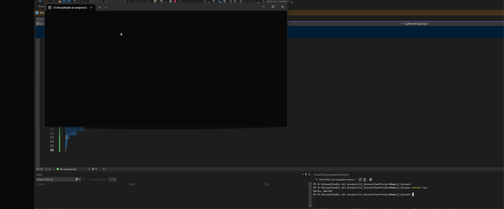


# 3_lesson - C# Data Types

This project demonstrates the usage of various C# primitive data types and displays their:
- Type name.
- Minimum and maximum values.
- Size of each data type in bytes.

## Data Types Covered:
1. **short (Int16)**
2. **int (Int32)**
3. **long (Int64)**
4. **float (Float32)**
5. **double (Float64)**
6. **decimal (Float128)**

## Project Structure:
```
3_lesson/
│   Program.cs
│   README.md
│   3_lesson.csproj
```

## How to Run:
1. **Navigate to the project folder:**
```
cd D:\VisualStudio all projects\3_lesson
```
2. **Run the project using .NET CLI:**
```
dotnet run
```

## Output Example:
```
Variable: short (int16)
System.Int16
Short min value: -32768
Short max value: 32767
Short value of data: 2

Variable: int (int32)
System.Int32
Int min value: -2147483648
Int max value: 2147483647
Int value of data: 4

Variable: long (int64)
System.Int64
Long min value: -9223372036854775808
Long max value: 9223372036854775807
Long value of data: 8
...
```

## Result gif 



## Explanation:
This program prints the type name, minimum value, maximum value, and the size (in bytes) of each C# data type listed above. It uses the `sizeof()` method and `MinValue` & `MaxValue` properties for displaying information.

## Requirements:
- .NET 6.0 or higher.
- Visual Studio or Visual Studio Code (recommended).


